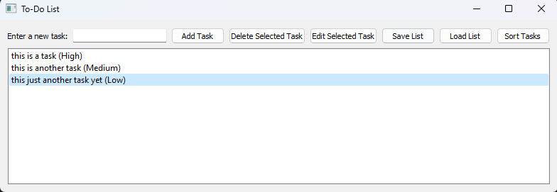

# To-Do List

A simple to-do list application built with PyQt5 in Python.

## Table of Contents
- [Overview](#overview)
- [Dependencies](#dependencies)
- [Installation](#installation)
- [Usage](#usage)
- [Features](#features)
- [License](#license)
- [Preview](#preview)

## Overview

The To-Do List application allows users to manage their tasks by adding, deleting, editing, sorting, saving, and loading tasks.

## Dependencies

- Python 3.x
- PyQt5

## Installation

1. Make sure you have Python 3.x installed. If not, you can download it from the [official Python website](https://www.python.org/downloads/).

2. Install the required dependencies by running the following command:

   ``pip install pyqt5``
   
## Usage

To run the application, execute the following command:

``python to-do-list.py``

The application window will open, and you can start managing your tasks using the provided interface.

## Features

- **Add Task:** Enter a new task, select its priority level (Low, Medium, High), and click the "Add Task" button to add it to the task list.

- **Delete Selected Task:** Select a task from the list and click the "Delete Selected Task" button to remove it from the task list.

- **Edit Selected Task:** Select a task from the list, click the "Edit Selected Task" button, and a dialog will appear. Enter the new task and select a new priority level (Low, Medium, High), then click "OK" to update the task.

- **Sort Tasks:** Click the "Sort Tasks" button to rearrange the tasks based on their priority level (High to Low).

- **Save List:** Click the "Save List" button to save the current task list to a text file. You will be prompted to choose the file location.

- **Load List:** Click the "Load List" button to load a previously saved task list from a text file. You will be prompted to choose the file location.

## License

This project is licensed under the MIT License. See the [LICENSE](LICENSE) file for details.

## Preview
